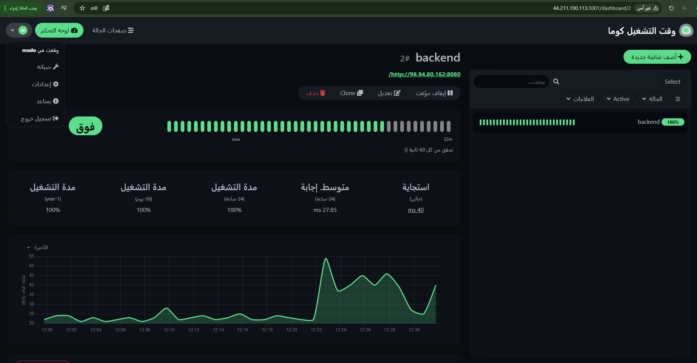
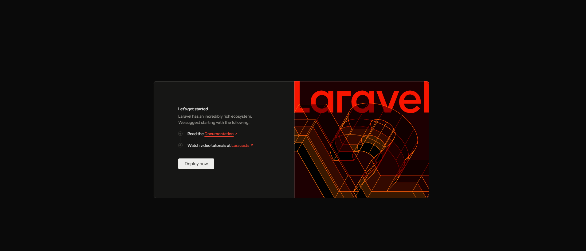
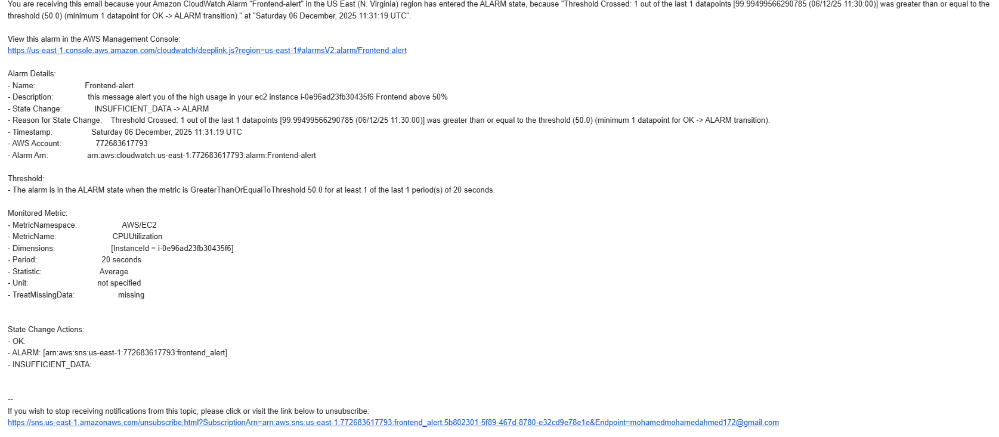
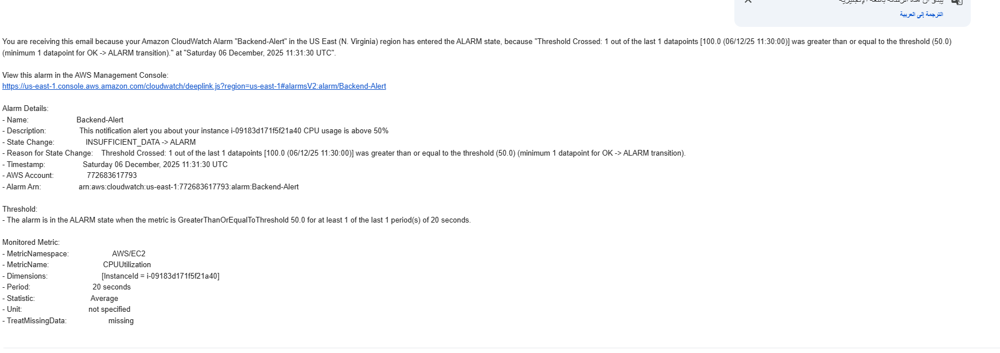

# 🚀 Obelion Cloud Automation Assessment - Project Submission

This repository contains the full Infrastructure as Code (Terraform) and Automation (GitHub Actions) solution for the Obelion Cloud Automation Assessment.

---

## 🏗️ Architecture Overview

The solution implements two **independent** web applications on AWS:
1.  **Frontend Project:** A Node.js based monitoring dashboard (Uptime Kuma).
2.  **Backend Project:** A Laravel PHP API connected to a secure MySQL Database.

### 1. Networking (`modules/networking`)
*   **Custom VPC:** `10.0.0.0/16` hosting all resources.
*   **Security Groups (Open Access):**
    *   **Frontend SG:** Allows traffic from anywhere (`0.0.0.0/0`) on ports  **22** (SSH), and **3001** (Uptime Kuma).
    *   **Backend SG:** Allows traffic from anywhere (`0.0.0.0/0`) on ports **8080** (Laravel) and **22** (SSH) for accessibility.
    *   **Database SG:** Strictly private, allowing access ONLY from the Backend Server on port 3306.

### 2. Compute (`modules/compute`)
*   **Dynamic AMI:** Automatically fetches the latest Ubuntu 22.04 LTS image.
*   **Frontend Server:** `t3.micro` instance running Dockerized Uptime Kuma.
*   **Backend Server:** `t3.micro` instance running Laravel with PHP 8.2.

### 3. Database (`modules/database`)
*   **RDS MySQL 8:** Deployed in a purely **Private Subnet** (No Internet Access).
*   **Storage:** `gp3` storage for optimized performance.

---

## ✅ Task Group B: CI/CD & Automation Results

### 1. Frontend Automation (Uptime Kuma)
*   **Workflow:** `.github/workflows/frontend-deploy.yml`
*   **Mechanism:** Docker Compose via GitHub Actions.
*   **Result:** Triggers automatically on push to `main` and deploys to the Frontend EC2.
*   **Proof:**


*Figure 1: Uptime Kuma dashboard accessible publicly.*

### 2. Backend Automation (Laravel)
*   **Workflow:** `.github/workflows/backend-deploy.yml`
*   **Mechanism:** Shell Scripting via SSH.
*   **Process:** Clones code, injects `.env` variables securely, and runs `php artisan migrate`.
*   **Proof:**


*Figure 2: Laravel Application connected to Private RDS.*

### 3. CloudWatch Monitoring
*   **Setup:** CPU Alerts configured via Terraform w/ SNS Notifications.
*   **Result:** Email alerts sent when CPU exceeds 50%.

| Frontend Alert | Backend Alert |
| :---: | :---: |
|  |  |

---

## ✅ Task Group C: Azure Migration Strategy

**Objective**: Migrate the AWS infrastructure (Ubuntu EC2s + MySQL RDS) to Azure with minimal downtime.

### 1. AWS to Azure: Concept Mapping
Since you are familiar with AWS, here is how the concepts translate to Azure:

| Concept | AWS Resource | Azure Equivalent | Reason |
| :--- | :--- | :--- | :--- |
| **Compute** | `EC2 Instance` | **Azure Virtual Machine (VM)** | Both are raw VMs. We will use `Standard_B1ms` (Burstable) which is cheaper and similar to AWS `t3.micro`. |
| **Network** | `VPC` | **Virtual Network (VNet)** | Both act as the isolated network container. |
| **Firewall** | `Security Group` | **Network Security Group (NSG)** | Azure NSGs are attached to the Subnet or NIC, similar to AWS SGs. |
| **Database** | `RDS MySQL` | **Azure Database for MySQL** | We will use the "Flexible Server" option for better cost/performance tuning. |
| **Storage** | `EBS Volume` | **Managed Disk** | Attached block storage for the VMs. |

### 2. Minimal Downtime Migration Strategy (Lift & Shift)

We will use a **"Rehost" (Lift & Shift)** strategy. This is the fastest way to migrate without rewriting code.

#### Phase 1: Infrastructure Build (Parallel & Risk-Free)
*   **Timeframe**: Days 1-2
*   **Goal**: Create an exact replica of the environment on Azure while AWS is still running.
*   **Action**: 
    1.  Create a Resource Group in Azure.
    2.  Provision VNet (`10.1.0.0/16`) to avoid IP conflict with AWS (`10.0.0.0/16`) in case we need VPN peering later.
    3.  Provision VMs (Frontend & Backend) and install dependencies (Docker, Nginx, PHP).
    4.  Provision Azure MySQL (Empty).

#### Phase 2: Data Replication (Zero Downtime)
*   **Critical Step**: We don't want to shut down AWS yet.
*   **Action**:
    1.  Use **Azure Database Migration Service (DMS)**.
    2.  Connect DMS to the AWS RDS (Source) and Azure MySQL (Target).
    3.  Start **Continuous Replication**. Any user saving data on AWS is immediately copied to Azure.

#### Phase 3: File Sync
*   **Tool**: `Rclone` or `AzCopy`.
*   **Action**: Copy uploaded files (e.g., user avatars, PDFs) from AWS EC2 `/var/www` to Azure VM.

#### Phase 4: The Cutover (Switch Day)
*   **Timeframe**: 30 Minutes (Maintenance Window).
*   **Steps**:
    1.  **Read-Only Mode:** Switch Laravel on AWS to "Maintenance Mode" (`php artisan down`). This stops new writes.
    2.  **Verify Sync:** Wait 2 minutes for Azure DB to catch up the last transaction.
    3.  **Cut Replication:** Stop the replication link. Azure DB is now a standalone Master.
    4.  **DNS Switch:** logging into your Domain Provider (e.g. GoDaddy) and change the "A Record" to point to the **Azure Frontend IP**.
    5.  **Go Live:** Bring Azure Laravel online (`php artisan up`).

---

## 🚀 Deployment Instructions

### Prerequisites
*   Terraform installed.
*   AWS Credentials configured.

### Steps
1.  **Provision:**
    ```bash
    terraform init
    terraform apply -auto-approve
    ```
2.  **Access:**
    *   **Frontend:** `http://<FRONTEND_IP>:3001`
    *   **Backend:** `http://<BACKEND_IP>:8080`
